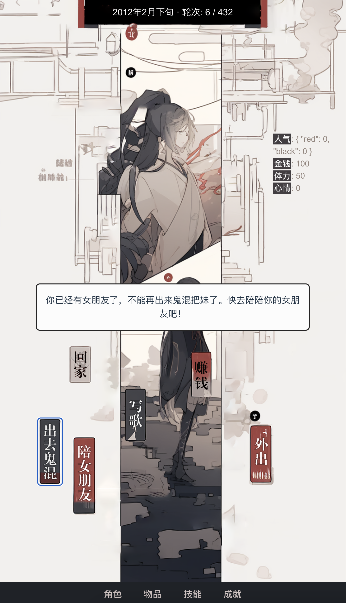
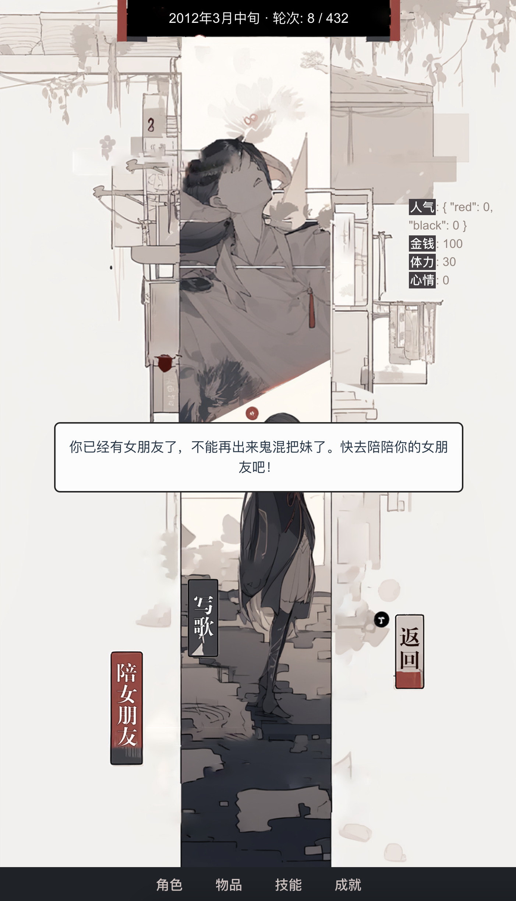

# 重生之我是姜云升

文字游戏，选择玩家角色姜云升行动，在 2012 年-2023 年共计 432 个轮次中，体验一些简单的小故事。
设计单周目游玩时长约 5-15 分钟。

游玩地址：https://jys.wtf

## 界面截图




## 技术架构

项目已**完全迁移至 [Vercel](https://vercel.com) 部署**。前端静态站点与后端接口同源托管，后端接口由 **Vercel Serverless Functions** 提供，并**直接读写 [Upstash KV（Redis）](https://upstash.com)**。

> 迁移前为「前端 + 独立后端 API 服务（`api.jys.wtf`）+ Docker/Nginx/Jenkins」架构；现已不再需要独立后端服务与跨域 API，Serverless 函数直连 KV 数据库。仓库中残留的 `Dockerfile`、`Jenkinsfile`、`.htaccess` 仅为历史遗留，不再用于部署。

### 数据流

```
浏览器 (Vue 3 SPA)
     │  axios → /api/*
     ▼
Vercel Serverless Functions  (api/*.ts，Web 标准 Request/Response)
     │  @upstash/redis (REST)
     ▼
Upstash KV (Redis)           ← 玩家与存档数据
```

本地开发时，Vite 会把 `/api` 反向代理到 `VITE_API_PROXY_TARGET`（默认 `https://api.jys.wtf`）；生产环境中 `/api/*` 由同域的 Vercel 函数直接处理。

### 技术栈

| 层 | 技术 |
| --- | --- |
| 前端 | Vue 3、Vuex 4、TypeScript、Vite、axios、lucide-vue-next、typeit |
| 接口 | Vercel Serverless Functions（TypeScript，原生 `Request`/`Response`） |
| 数据库 | Upstash KV（Redis），通过 `@upstash/redis` REST 客户端访问 |
| 部署 | Vercel（静态构建产物 + Serverless Functions） |

### 目录结构

```
.
├── api/                    # Vercel Serverless Functions（路由即文件）
│   ├── players.ts          # GET 玩家列表 / POST 连接或创建玩家
│   ├── players/[id].ts     # PUT 更新玩家
│   ├── plays.ts            # POST 新建存档
│   └── plays/[id].ts       # GET 读取存档 / DELETE 删除存档
├── server/lib/             # 接口共享逻辑（被 api/ 引用）
│   ├── redis.ts            # Upstash Redis 客户端（单例）+ 自增 ID
│   ├── models.ts           # PlayerModel / PlayModel 数据模型
│   ├── http.ts             # JSON 响应、错误处理、请求解析
│   ├── validators.ts       # 昵称 / 邮箱 / 布尔值校验
│   └── errors.ts           # ApiError / ServerConfigError
├── src/                    # 前端 Vue 应用
│   ├── components/          # 游戏界面与各类弹窗组件
│   ├── store/               # Vuex store（游戏核心逻辑、行动、内容数据）
│   ├── config/api.ts        # 前端 API base url（默认 /api）
│   └── ...
├── vercel.json             # 函数配置（maxDuration）与安全响应头
├── tsconfig.api.json       # api/ 与 server/ 的类型检查配置
└── vite.config.ts          # 前端构建与 /api 本地代理
```

### 数据存储（Upstash KV）

接口直接对 Redis 进行读写，主要 key 设计如下：

| Key | 类型 | 说明 |
| --- | --- | --- |
| `counter:player` / `counter:play` | string (INCR) | 玩家 / 存档自增 ID |
| `players:{id}` | JSON | 玩家信息 |
| `players:email:{email}` | string | 邮箱 → 玩家 ID 索引（同时保存原始与小写两份） |
| `players:all` | set | 全部「非匿名」玩家 ID 集合（用于排行 / 名单展示） |
| `plays:{id}` | JSON | 存档元数据（不含 state） |
| `plays:player:{id}` | list | 某玩家的存档 ID 列表（单玩家上限 99 条） |
| `plays:{id}:state` | JSON | 存档状态（体积较小时内联存储） |
| `plays:{id}:meta` + `plays:{id}:chunk:{i}` | JSON + string | 大体积存档的分片存储 |

存档体积策略：state 序列化后 ≤ 750KB 直接内联保存；超过则按 200K 字符分片写入多个 chunk；硬上限 5MB，超过即拒绝保存。保存前会清理冗余字段（`player`、`plays`、`textHistory` 等）以减小体积。

### API 接口

| 方法 | 路径 | 说明 |
| --- | --- | --- |
| `GET` | `/api/players` | 返回所有非匿名玩家昵称 |
| `POST` | `/api/players` | 连接已有账号或创建新玩家（按邮箱匹配） |
| `PUT` | `/api/players/:id` | 更新玩家（昵称 / 匿名设置，需邮箱校验） |
| `POST` | `/api/plays` | 新建存档（需玩家 ID + 邮箱校验） |
| `GET` | `/api/plays/:id?playerId=&email=` | 读取存档完整 state |
| `DELETE` | `/api/plays/:id` | 删除存档（需玩家 ID + 邮箱校验） |

账号体系无密码，以「昵称 + 邮箱」作为弱身份凭证：所有写操作都会校验请求邮箱与库中玩家邮箱（大小写不敏感）是否一致。

## 本地开发

### 环境变量

接口运行需要 Upstash 凭据（任选一组，优先读取 `KV_REST_API_*`）：

```bash
KV_REST_API_URL=...            # 或 UPSTASH_REDIS_REST_URL
KV_REST_API_TOKEN=...          # 或 UPSTASH_REDIS_REST_TOKEN
```

前端可选环境变量：

```bash
VITE_API_BASE_URL=...          # 覆盖前端请求的 API base，默认 /api
VITE_API_PROXY_TARGET=...      # 本地 dev 时 /api 的代理目标，默认 https://api.jys.wtf
```

### 安装与启动

```bash
npm install
npm run dev        # 启动 Vite 开发服务器
npm run typecheck  # 前端（vue-tsc）+ 接口（tsconfig.api.json）类型检查
npm run build      # 类型检查并产出生产构建到 dist/
```

> 若希望本地同时调试 Serverless Functions（连真实 Upstash KV），可使用 `vercel dev`（需安装 Vercel CLI 并配置上述环境变量）。

## 部署（Vercel）

1. 在 Vercel 导入本仓库，框架预设为 Vite（构建命令 `npm run build`，输出目录 `dist`）。
2. 在 Vercel 项目中配置 Upstash KV 集成或手动填入 `KV_REST_API_URL` / `KV_REST_API_TOKEN` 环境变量。
3. `api/` 下的文件会被自动识别为 Serverless Functions（见 `vercel.json`，单函数最长执行 10s）。
4. 推送到对应分支即可触发自动部署（`dev` 分支生成预览部署，`master` 为生产）。

---

## 机制设计
- [x] 人物属性机制
- [x] 金钱机制
- [x] 回合行动机制
- [x] 外出机制
- [x] 交女朋友、分手机制
- [x] 结局机制
- [x] 写歌机制
- [x] 成就机制
- [x] 物品机制
- [x] 购物、交易机制
- [x] 存档 / 读档机制（云端，基于 Upstash KV）

## 内容设计
- [ ] 成就图鉴
- [ ] 歌曲清单（已列） - 开发中

## 人物属性

透明属性：
  talent: '才华',
  charm: '魅力',
  popularity: '人气'（红/黑）
  money: '金钱',
  skill: '技能',
  energy: '体力',
  mood: '心情',

隐藏属性(1)

## 写歌设计

-[x] 《浪漫主义》：才华值>100，魅力值>100，隐藏属性>100
-[x] 《浪漫主义2.0》：才华值>100，魅力值>100，体力>90
-[x] 《真没睡》：交过10个女朋友，收集物品衣服>5，包包>5；才华>100
-[x] 《孤独面店》：心情值<50；交过2个女朋友分手以后，连续3个月没有再交女朋友，也没有去鬼混把妹
- 《宅》：累计回家超过10次，游戏技能>10
-[x] 《你一定能成为你想要去成为的人》：才华>120，隐藏属性>100，金钱<10000
-[x] 《SAD》：被分手1个月之内，立即外出鬼混，心情<50
- 《反抗》：
- 《爱の小曲》：外出事件随机拍到晚霞>2次，学会声乐技能
- 《想你》：被分手1个月之内，金钱>100000，心情<50，拥有艺人顾帅
-[x] 《网易云》：才华>80，心情<0
-[x] 《这首歌没唱直接听》：freestyle技能>20
- 《拼个世界给自己》：才华>100，巡演获得皮卡丘积木，学会声乐技能
-[x] 《流量Rapper》：人气>3000
- 《舞台上》：Freestyle技能>25，人气>1000，黑人气>500，金钱>2000000
- 《自白书》:2016年1月后，才华>30，魅力>30
- 《皮卡丘》：收集皮卡丘物品>520
- 《Battle》：Freestyle技能>30，参加Battle比赛>10次，获得过冠军
- 《28.7》
- 《天选》：游戏技能>20；

- 《孤注一掷》：才华>100，体力<0
- 《3》：收集皮卡丘物品>10，被分手1个月之内
- 《看透一切》：发歌数量>10，人气>500，隐藏属性>50
- 《日记》：2019年9月；心情<20
- 《云霄》：才华>100，外出上山>10次，隐藏属性>100

- 早期情歌组合：
- 《举步维艰》：体力>80，外出鬼混>2次
- 《遇见你》：体力>80，当前有女朋友

- 《围城》：被分手3个月之后，心情<20
- 《不后悔遇见你》：交过3个女朋友以上，并被分手
- 《呵呵》
- 《患》：交过1个女朋友并分手，才华>80，隐藏属性>50，心情<0

## 技能设计

Freestyle 技能（共计28点）：
   - 常规升级方式：外出通过 Battle 比赛提升
   - 特殊升级方式：事件触发
   - 晋级提问
      问答题：x1 x2 x3
         地面 欲念
         清晨的烟幕
         你一定能够成为你想要去成为的人


游戏技能：
   - 常规升级方式：回家休息打游戏提升
   - 特殊升级方式：事件触发
   - 晋级提问
      合成大西瓜

技能页面有mapping

## 外出活动

### 吃

外出随机解锁食物，如猪肝面等，每种食物对应的金钱不同，增加体力不同。

## 特殊事件

去掉路费剩126.

## 成就/结局设计
结局（可同时达成多结局）：
- HE
	-[x] 【汤臣一品】：金钱>100000000。
	-[x] 【刀削面子】：累计女友数量>10，发布歌曲《浪漫主义》、《浪漫主义2.0》，结局时没有和当前女朋友分手。
	-[x] 【皮卡皮卡】：累计购买皮卡丘玩偶>520件，且没有发布合作曲《3》，解锁皮卡丘结局，和皮卡丘快乐地生活在一起。
- NE
	-[x] 【一肩明月，两袖清风】：结局时金钱<99999。
- BE
	-[x] 【姜云升虚弱】：体力<-100，透支完毕，结束游戏。
	-[x] 【我不做人啦】：心情<-100，过于emo，结束游戏。


成就：
-[x] 【拜拜就拜拜】：累计被分手10次。
- 【初】：发布专辑初的所有音乐。
-[x] 【被敲碎的小金猪】：
-[x] 【二八分】
-[x] 【小姜的餐馆】：解锁所有美食。
- 【全场奶茶我包了】：失恋后1个月内，去找好吃的，花费金钱100.
-[x] 【这歌废了】：写过超过16次废歌。

-[x] 【我所拥有的人气，又是不是真的？】人气>1200，黑人气>1000。
-[x] 【谢谢你们提醒我吃维生素】收集所有的维生素片
-[x] 【姜哥，玩挺好】在家陪女朋友时随机触发。
-[x] 【时间很长】指的是姜云升的睡眠时间很长，在一轮游戏中累计睡眠时间达到500个小时。
-[x] 【醉酒小姜】不是酒后吐真言，是借着喝醉说心里话。
-[x] 【十年】游戏进程达到10年。
